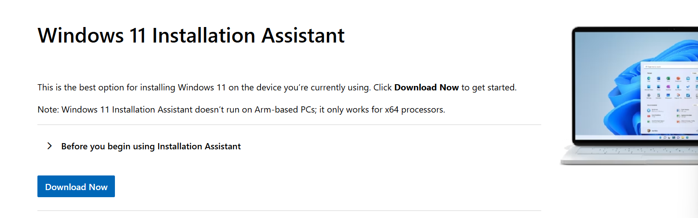
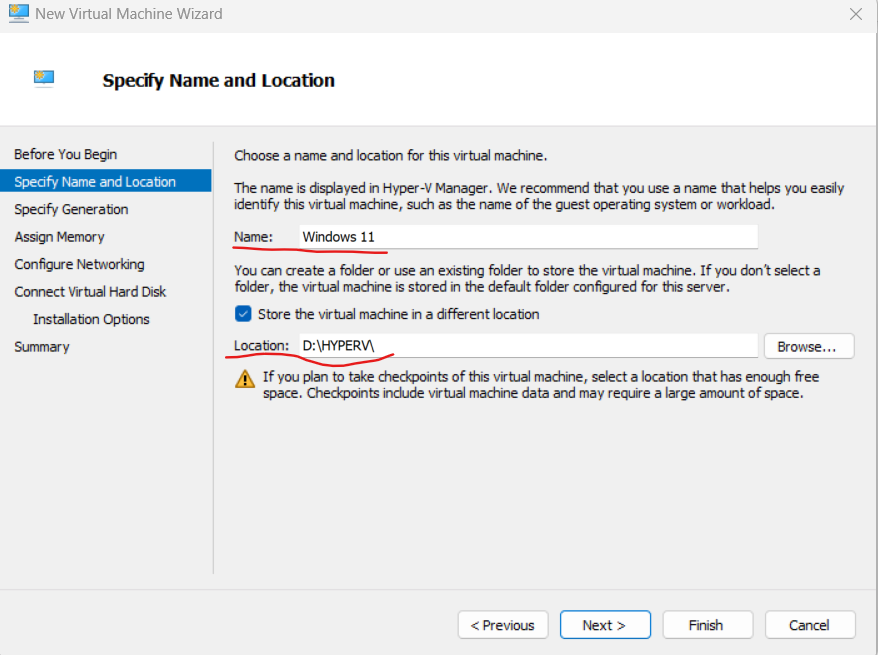
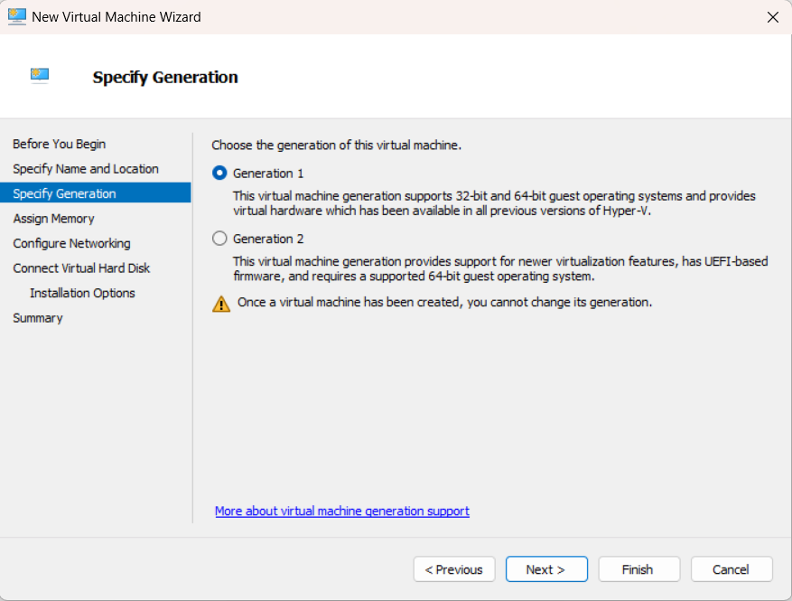
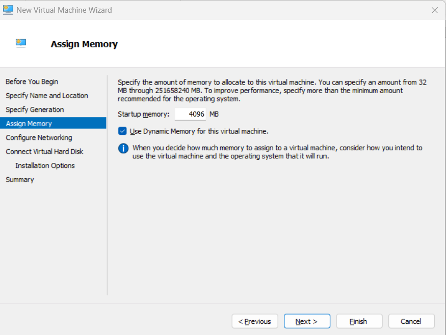
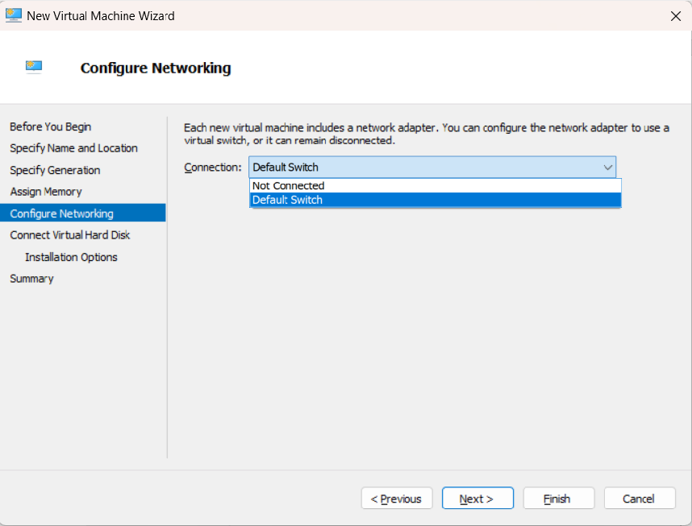
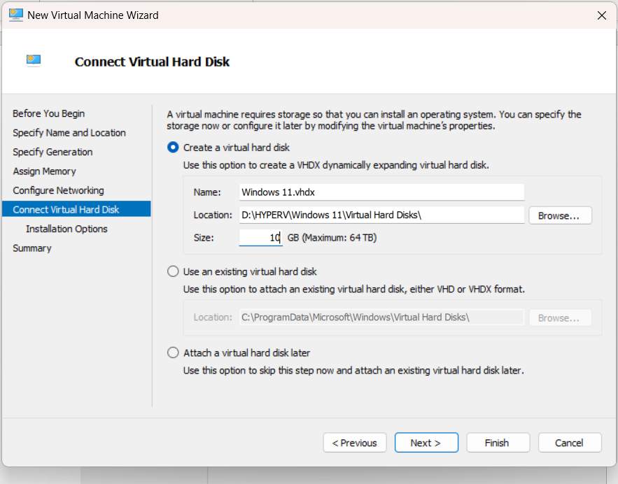
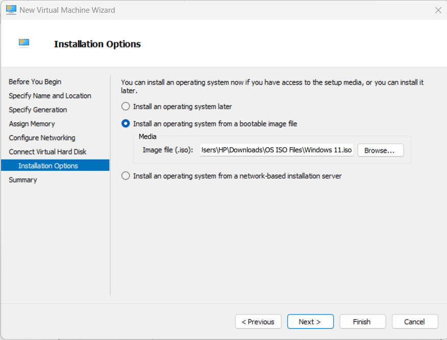
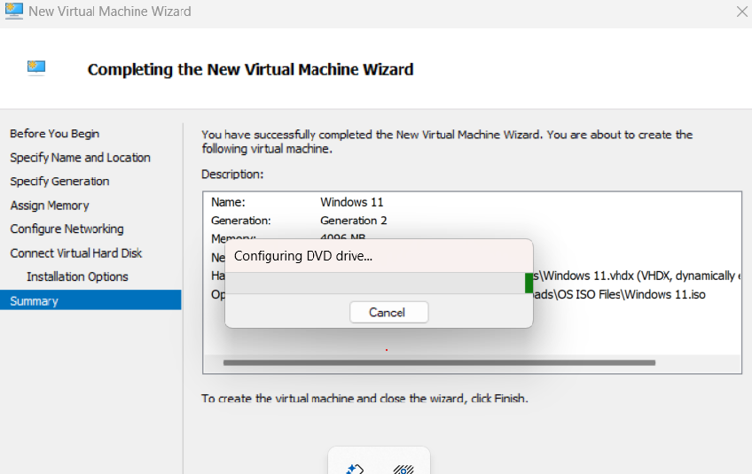
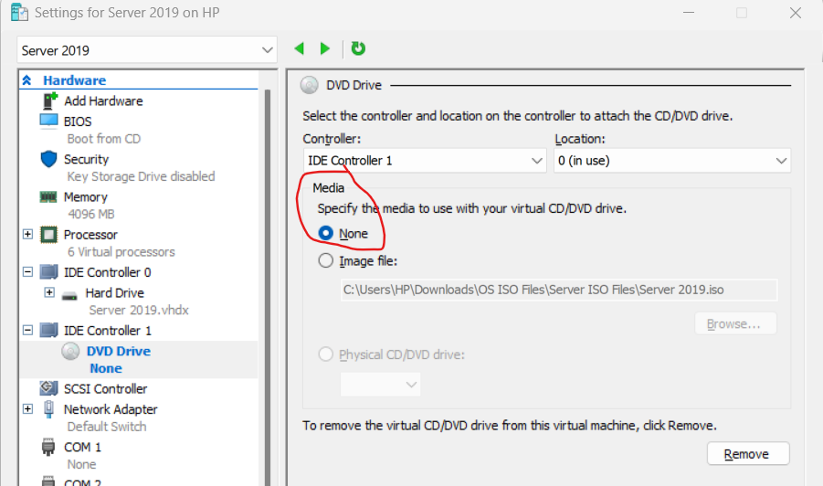

# HyperV-Multi-Server-Lab

\# Hyper-V Multi-Server Lab Setup (2016, 2019, 2022)

\## 📖 Overview

This project documents the installation and configuration of a virtual lab environment containing three different versions of Windows Server.

\### Key Concepts

\* \*\*Virtualization:\*\* Running multiple "Virtual Machines" (VMs) on one physical computer.

\* \*\*Hyper-V:\*\* The "House" (Hypervisor) that hosts the virtual rooms (VMs).

\* \*\*VM:\*\* The individual "Rooms" (Servers) running independent operating systems.

---

\## 💾 Storage: VHD vs. VHDX

For this lab, I am using the \*\*VHDX\*\* format.

| Feature | VHD | VHDX |

| :--- | :--- | :--- |

| \*\*Capacity\*\* | Max 2 TB | Max 64 TB |

| \*\*Resilience\*\* | Low (Corrupts easily) | High (Power failure protection) |

---

\## 🛠️ Step-by-Step Installation

\###Navigate to Google and search for “download windows server 2016 /or download windows server 2019 /or download windows server 2022 iso”, click on Link the appears on google search.

\###Open **Hyper-V Manager**

Navigate to:Actions → New → Virtual Machine
Enter the VM name and choose the storage location.

\### Step 3 – Choose Generation

Select: Generation 1

---

### Step 4 – Assign Memory (RAM)

Configure the RAM depending on your system resources.

Example:4096 MB

---

### Step 5 – Configure Networking

Select: Default Switch

---

### Step 6 – Configure Virtual Hard Disk

Minimum recommended size: 12 GB

Choose the storage location.

---

### Step 7 – Select ISO File

Choose the downloaded **Windows Server ISO file**.

---

### Step 8 – Finish VM Creation

Review the configuration summary and click **Finish**.

The configuration process takes approximately **10 minutes**.

---

# Installing the Operating System

Start the virtual machine and follow the Windows installation steps.

Allocate the unallocated disk space and complete the installation.

Example password used for lab:P@ssw0rd

---

# Eject the ISO File

To prevent the installation loop:

1. Right-click the VM
2. Select **Settings**
3. Go to **DVD Drive**
4. Select **None**

Click **Apply → OK**

---

# Initial Server Configuration

Open **Server Manager**.

Then configure the following:

### Rename the Server

Rename the machine according to your organization's naming convention.

---

### Disable Firewall (Lab Purpose Only)

Firewall may be temporarily disabled for testing connectivity.

⚠️ Not recommended in production environments.

---

### Enable Remote Desktop (RDP)

Enable RDP to allow remote access.

---

### Configure Network (IPv4)

Steps:
Network Adapter
→ Properties
→ IPv4
→ Configure Static IP

Use the same network range as the host machine.

---

### Enable Windows Updates

Ensure updates are enabled for stability and security.

---

### Disable Real-Time Protection (Lab Purpose)

Temporarily disable Windows Defender if required for testing.

---

### Disable Internet Explorer Enhanced Security

Turn off IE Enhanced Security to allow web browsing inside the server.

---

### Configure Date and Time

Ensure correct timezone and system time.

---

### Install .NET Framework 3.5

Required for certain legacy applications.

---

# Exporting and Importing Virtual Machines

This allows you to back up or move virtual machines.

---

## Export VM

Steps:

1. Right-click VM
2. Select **Export**
3. Choose export location
4. Click **Export**

---

## Import VM

Steps:

1. Open Hyper-V Manager
2. Click **Import Virtual Machine**
3. Select exported folder
4. Choose:Register the virtual machine in place

or Copy the virtual machine

---

# Checkpoints

Checkpoints allow you to save the current state of a virtual machine.

This works similar to **System Restore**.

Example use case:

Before making risky configuration changes.

---

## Create Checkpoint  Right Click VM → Checkpoint

---

## Restore Checkpoint
Right Click Checkpoint → Apply

The VM will revert to the previous saved state.

---

# Conclusion

This lab demonstrates how to:

- Create virtual machines using Hyper-V
- Install Windows Server
- Configure server settings
- Manage VM backups
- Use checkpoints for recovery

This setup is commonly used for **learning system administration, networking, and cybersecurity labs**.

--

