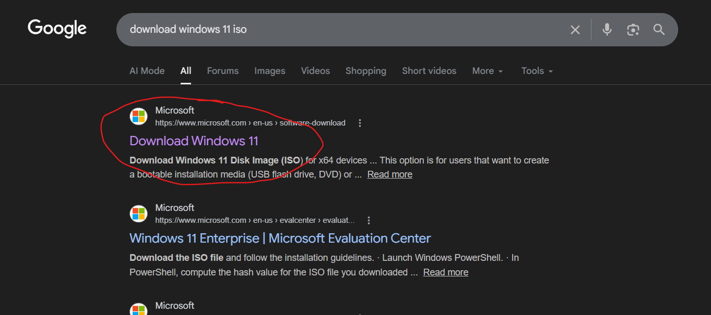

# HyperV-Multi-Server-Lab

\# Hyper-V Multi-Server Lab Setup (2016, 2019, 2022)

\## 📖 Overview

This project documents the installation and configuration of a virtual lab environment containing three different versions of Windows Server.

\### Key Concepts

\* \*\*Virtualization:\*\* Running multiple "Virtual Machines" (VMs) on one physical computer.

\* \*\*Hyper-V:\*\* The "House" (Hypervisor) that hosts the virtual rooms (VMs).

\* \*\*VM:\*\* The individual "Rooms" (Servers) running independent operating systems.

---

\## 💾 Storage: VHD vs. VHDX

For this lab, I am using the \*\*VHDX\*\* format.

| Feature | VHD | VHDX |

| :--- | :--- | :--- |

| \*\*Capacity\*\* | Max 2 TB | Max 64 TB |

| \*\*Resilience\*\* | Low (Corrupts easily) | High (Power failure protection) |

---

\## 🛠️ Step-by-Step Installation

\###Navigate to Google and search for “download windows server 2016 /or download windows server 2019 /or download windows server 2022 iso”, click on Link the appears on google search.

\###Open **Hyper-V Manager**

Navigate to:Actions → New → Virtual Machine
Enter the VM name and choose the storage location.

\### Step 3 – Choose Generation

Select: Generation 1

---

### Step 4 – Assign Memory (RAM)

Configure the RAM depending on your system resources.

Example:4096 MB

---

### Step 5 – Configure Networking

Select: Default Switch

---

### Step 6 – Configure Virtual Hard Disk

Minimum recommended size: 12 GB

